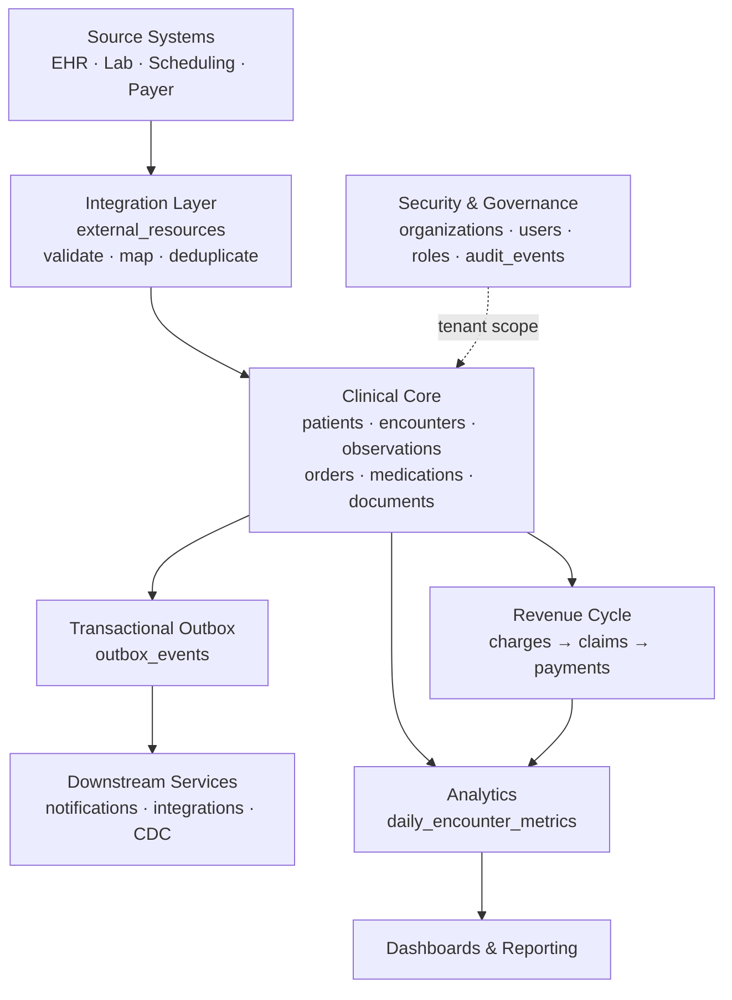
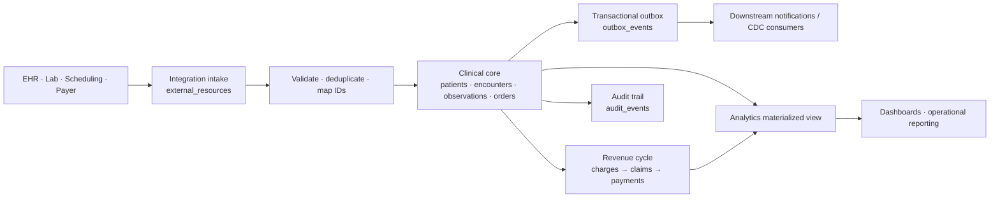
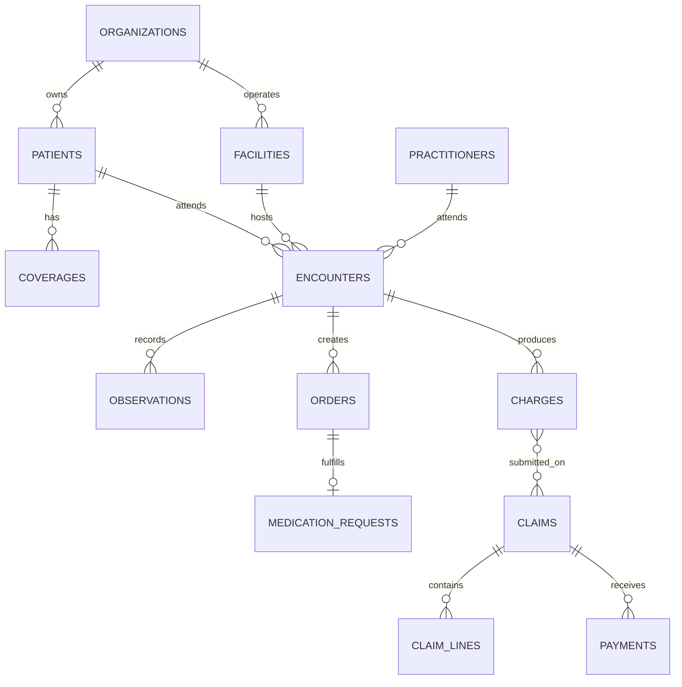
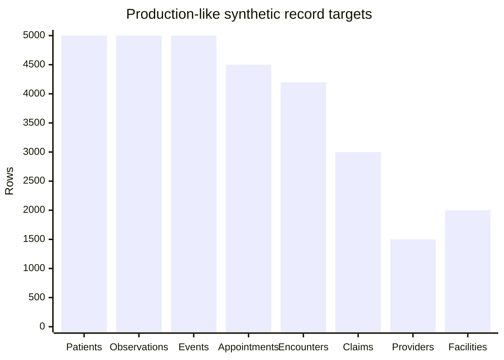
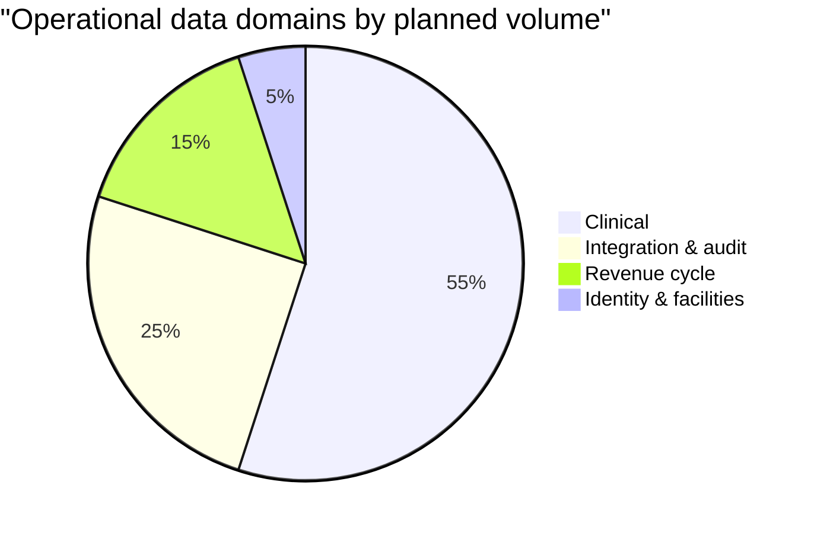

# Healthcare Data Platform Architecture

## Architecture overview

> GitHub-safe architecture diagram: this section has no external image dependency and renders directly in GitHub Markdown.

The PNG and SVG files remain optional downloadable companions. To display them on GitHub, commit them in the same folder as this Markdown file.

The platform is a multi-tenant clinical data system on Neon Postgres. It preserves raw interoperability payloads, normalizes them into clinical entities, derives financial workflows, emits reliable events, and publishes reporting metrics.

## End-to-end pipeline

## Schema map

## Data-volume profile

## Layer responsibilities

| Layer | Schema | Responsibility |
|---|---|---|
| Identity and security | `iam` | Tenant scope, users, roles, facilities, immutable audit evidence |
| Clinical system of record | `clinical` | Patient identity, care episodes, clinical findings, orders, documents |
| Revenue cycle | `billing` | Charges, payer claims, adjudication outcomes, payments |
| Interoperability | `integration` | Source payload retention, idempotency, downstream event delivery |
| Analytics | `analytics` | Reporting-oriented aggregates separated from transactional workloads |

## Design rules

1. Every clinical and financial record is scoped to an organization, directly or through its patient/encounter relationship.
2. Raw source payloads are retained before normalization for traceability and replay.
3. Clinical writes and outbox events are produced atomically to prevent lost notifications.
4. Audit events record sensitive access and meaningful changes.
5. Dashboards read aggregates, not the operational clinical tables.

## Recommended next hardening steps

- Add row-level security policies using the active organization claim.
- Partition `audit_events`, `outbox_events`, and `observations` by time at larger scale.
- Add code-system reference tables for ICD, LOINC, SNOMED, and CPT mappings.
- Publish de-identified analytics views for non-clinical reporting users.
